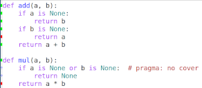

# pycov-mode

A GNU/Emacs minor mode that visualizes [`coverage.py`](https://coverage.readthedocs.io/)
status in the left fringe of Python buffers.

This basically loads a `JSON` file exported by [`coverage
json`](https://coverage.readthedocs.io/en/6.0/cmd.html#cmd-json), and decorates the referenced
Python sources putting a symbol in the left fringe, showing *covered*, *uncovered* and
*ignored* lines. Whenever the file changes, the decorations will be updated accordingly.

## Table of Contents

- (Installation)[#installation]
- (Usage)[#usage]

## Installation

As I do not foresee releasing the package on [`MELPA`](https://melpa.org/), you must install
this manually, copying the `pycov-mode.el` somewhere in your `load-path` and then activate it
in Python buffers:

``` emacs-lisp
(add-hook 'python-mode-hook 'pycov-mode)
```

If you use [`Doom Emacs`](https://github.com/hlissner/doom-emacs) then something like the
following should work:

``` emacs-lisp
(package! pycov-mode
  :recipe (:host github :repo "lelit/pycov-mode"))

(use-package! pycov-mode
  :hook
  (python-mode . pycov-mode))
```

## Usage

`pycov-mode` reads the `JSON` file pointed by the `pycov-coverage-file` per-buffer variable. I
usually have a `check` rule in my *Makefile*, something like

``` makefile
check:
	coverage run -m pytest
	coverage json -o coverage.json
```

that updates the *coverage.json* each time I run the tests.

The remaining missing piece is setting the variable `pycov-coverage-file`: as it's already
marked as *safe*, I usually have the following entry in my top level *.dir-locals.el* file:

``` emacs-lisp
((python-mode . ((pycov-coverage-file . "coverage.json"))))
```
